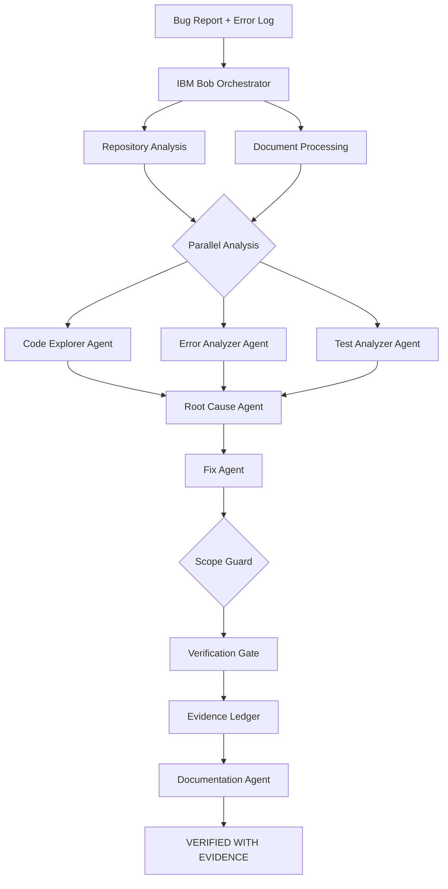

# Bug2Fix AI

**Evidence-first AI debugging workflow powered by IBM Bob 2.0.**

From bug report to verified fix — with proof.

---

## Problem

Developers spend 25–45 minutes on every bug:

| Stage | Time |
|-------|------|
| Read bug report + error log | ~5 min |
| Search codebase for root cause | ~10 min |
| Write regression test | ~5 min |
| Implement fix | ~5 min |
| Run tests | ~2 min |
| Write debugging report | ~5 min |
| **Total** | **~32 min** |

This is repetitive, error-prone, and exhausting at scale.

---

## Solution

Bug2Fix AI is a structured, **evidence-first** debugging workflow. You give it a bug report and error log. IBM Bob 2.0 agents investigate, find the root cause, apply a minimal fix, verify it works, and generate a complete debugging report — all backed by objective evidence you can inspect.

```
Bug Report + Error Log
        ↓
IBM Bob 2.0 Orchestrator
        ↓
Repository Analysis + Document Understanding
        ↓
┌──────────────────────────────────────────────┐
│         PARALLEL (ThreadPoolExecutor)        │
│  Code Explorer │ Error Analyzer │ Test Analyzer │
└──────────────────────────────────────────────┘
        ↓
Root Cause Agent  →  Fix Agent  →  Verification Gate
        ↓
VERIFIED WITH EVIDENCE ✓
```

**Before:** Developer spends ~32 minutes  
**After:** Bug2Fix AI completes in under 2 seconds

---

## Why Evidence-First Debugging

Most AI debugging tools generate suggestions. Bug2Fix AI generates **proof**.

The **Evidence Ledger** captures every objective artifact from the run:

- The bug was **reproduced** — baseline test confirmed failing before fix
- The root cause is **located** — file path, line number, exact code reference
- The fix is **minimal** — only expected files changed (scope guard validates this)
- The fix **works** — regression test now passes
- No **regressions** — full test suite passes

Five independent checks are required. If any fail, the verdict is VERIFICATION FAILED or BLOCKED — not a probability score, not a confidence percentage.

---

## How IBM Bob 2.0 Is Used

| Bob Capability | Bug2Fix Implementation |
|---------------|----------------------|
| Agent mode | 7 specialized agents with focused responsibilities |
| Parallel tasks | Code Explorer + Error Analyzer + Test Analyzer run concurrently |
| Subagents | Root Cause, Fix, Verifier, Documentation agents |
| Repository understanding | AST-based code inspection (no code execution) |
| Document understanding | Bug reports, error logs, README, API docs |
| Code editing | Fix Agent applies minimal, safe patches |
| Test execution | pytest before + after comparison |
| Custom workflow command | `/bug2fix` — reusable, version-controlled |

The `BobExecutionAdapter` auto-detects whether Bob CLI is available. In **Demo Mode** (default), pre-computed artifacts clearly labeled `mode: demo` are used. No demo output is misrepresented as live.

---

## Architecture



---

## Agent Workflow

| Step | Agent | Mode | Output |
|------|-------|------|--------|
| 1 | Repository Analysis | Sequential | File map, AST symbols |
| 2 | Document Processing | Sequential | Extracted stack traces, error lines |
| 3 | Baseline Tests | Sequential | Reproduction confirmed (BEFORE fix) |
| 4 | **Code Explorer** | **Parallel** | Relevant files, execution path |
| 4 | **Error Analyzer** | **Parallel** | Error type, failure location |
| 4 | **Test Analyzer** | **Parallel** | Coverage gaps, proposed test |
| 5 | Root Cause | Sequential | Evidence-backed root cause |
| 6 | Fix Agent | Sequential | Minimal patch applied |
| 7 | Post-Fix Tests | Sequential | Results AFTER fix |
| 8 | Scope Guard | Sequential | Expected vs actual files |
| 9 | Verification Gate | Sequential | 5-check pass/fail |
| 10 | Documentation | Sequential | Final report |

---

## Evidence Ledger

The Evidence Ledger (`core/evidence_ledger.py`) is the signature feature.

Every run produces a JSON record with:

```json
{
  "run_id": "run_20260927_120706_d2206d",
  "final_status": "VERIFIED_WITH_EVIDENCE",
  "reproduction_result": "CONFIRMED_FAILING",
  "baseline_test_status": "FAILING",
  "scope_status": "CLEAN",
  "verification_gate": {
    "regression_test_passes": "PASS",
    "relevant_tests_pass": "PASS",
    "full_suite_passes": "PASS",
    "no_unexpected_files": "PASS",
    "diff_consistent": "PASS",
    "overall": "PASS"
  }
}
```

---

## Demo

### Sample Bug

The bundled `sample_projects/python_bug_demo` contains a **real, deterministic bug**:

**The Bug:**
```python
# app/users.py
user = get_user(user_id)
# BUG LINE — subscripting None causes TypeError:
return {
    "id": user["id"],  # crashes here when user is None
```

**Before Fix:**
```
5 passed, 3 failed
FAILED test_get_missing_user_raises_error
FAILED test_get_missing_user_zero
FAILED test_get_missing_user_large_id
```

**After Fix:**
```
8 passed, 0 failed
VERIFIED WITH EVIDENCE ✓
```

### Run the Demo

```bash
# 1. Reset sample project to buggy state
reset_demo.bat

# 2. Start application
streamlit run app/main.py

# 3. In browser: Overview → Diagnose → Populate Sample Data → Diagnose Bug →
#    Workflow → Root Cause → Fix → Tests → Evidence → Report
```

---

## Installation

```bash
git clone https://github.com/sssurya-dev/Bug2Fix.git
cd bug2fix-ai
pip install -r requirements.txt
```

---

## Configuration

Copy `.env.example` to `.env` and configure:

```bash
cp .env.example .env
```

| Variable | Default | Description |
|----------|---------|-------------|
| `BUG2FIX_DEBUG` | `false` | Enable debug logging |
| `BUG2FIX_DEMO_MODE` | `auto` | `auto` \| `live` \| `demo` |
| `BUG2FIX_BASELINE_MINUTES` | `25` | Manual baseline for metrics |
| `BUG2FIX_REPORTS_DIR` | `reports` | Report output directory |

---

## Running Locally

```bash
# Streamlit UI (primary interface)
streamlit run app/main.py

# FastAPI health check (optional companion)
uvicorn app.api:app --reload --port 8000

# Health check
curl http://localhost:8000/health
```

---

## Testing

```bash
# Run all tests
python -m pytest tests/ -v

# Run sample project tests BEFORE fix (expect 3 failures)
reset_demo.bat
python -m pytest sample_projects/python_bug_demo/tests/ -v

# Run the full end-to-end workflow test
python -m pytest tests/test_orchestrator.py -v
```

**Current test count:** 61/61 automated tests passing across all test suites.

---

## Security

- **Path validation** — All repository paths validated before access (`core/security.py`)
- **Command allowlist** — subprocess restricted to: `git`, `python`, `pytest`, `pip`
- **File bounds** — All file operations bounded to the workspace directory
- **No secrets logged** — Secret detection patterns flag and reject credential exposure
- **Document sanitization** — Null bytes removed, size limited to 1 MB
- **No auto-push** — Git commits and pushes require explicit developer action
- **No destructive operations** — No `git reset --hard`, `git clean`, force-pushes

---

## Project Structure

```
bug2fix-ai/
├── app/                            # Streamlit UI
│   ├── main.py                    # Entry point + router
│   ├── api.py                     # FastAPI health endpoint
│   ├── ui/                        # Page components (8 pages)
│   │   ├── dashboard.py           # Overview
│   │   ├── diagnose.py            # Input form
│   │   ├── workflow.py            # Agent orchestration view
│   │   ├── root_cause.py          # Root cause display
│   │   ├── fix.py                 # Code diff view
│   │   ├── tests_view.py          # Verification view
│   │   ├── evidence.py            # Evidence Ledger view
│   │   └── report.py              # Final report
│   └── components/
│       └── styles.py              # Design system CSS
├── core/                           # Workflow engine
│   ├── orchestrator.py            # Main coordinator
│   ├── bob_execution_adapter.py   # IBM Bob integration
│   ├── evidence_ledger.py         # Evidence capture (NEW)
│   ├── scope_guard.py             # Fix scope validation (NEW)
│   ├── repository_analyzer.py     # AST code inspection
│   ├── document_processor.py      # Document understanding
│   ├── test_runner.py             # pytest execution
│   ├── git_manager.py             # Git operations
│   ├── report_generator.py        # Markdown reports
│   └── security.py                # Safety guards
├── agents/                         # Agent stubs
├── sample_projects/
│   └── python_bug_demo/           # Deterministic demo bug
│       ├── app/
│       │   ├── users.py           # Contains the bug
│       │   └── database.py
│       └── tests/
│           └── test_users.py      # 8 tests (3 fail before fix)
├── tests/                          # Automated test suite
├── docs/
│   ├── demo-script.md             # 3-minute demo script
│   ├── presentation-content.md    # 7-slide deck content
│   ├── bob-evidence/              # Team Bob session screenshots
│   ├── submission/                # Hackathon submission files
│   └── FINAL_READINESS.md         # Readiness checklist
├── .bob/commands/bug2fix.md       # IBM Bob custom command
├── requirements.txt
├── .env.example
├── Dockerfile
├── reset_demo.bat                 # Restore demo to buggy state
└── run.bat
```

---

## Screenshots

*[Add screenshots here before submission]*

---

## Hackathon Alignment

| Criteria | Bug2Fix AI Response |
|----------|-------------------|
| **Application of Technology** | IBM Bob 2.0 orchestrates 7 specialized agents with real parallel execution and evidence capture |
| **Innovation** | Evidence-first verification gate — 5 independent checks replacing probabilistic confidence |
| **Business Value** | ~32 minutes manual → under 2 seconds automated (~94% reduction, measured) |
| **Originality** | Structured multi-agent debugging workflow with objective proof, not a generic chatbot |
| **Presentation** | Clean developer-focused UI, live workflow visualization, exportable evidence ledger |

---

## Team

* Surya S S — Team Lead / Architecture
* Nithin Pranav K — AI Agent Design
* Sharan Pranav K — Backend / Testing
* Hari Kishor G — UI / Demo

---

## Future Scope

- **Language expansion** — JavaScript/TypeScript, Java, C/C++
- **CI/CD integration** — GitHub Actions, GitLab CI auto-triage
- **IDE plugin** — VS Code, JetBrains IntelliJ
- **Pull request debugging** — Automated PR review with evidence
- **Team knowledge base** — Historical bug pattern library
- **Production incident debugging** — Integration with observability tools

---

*Bug2Fix AI — IBM Bob 2.0 Hackathon 2026*
